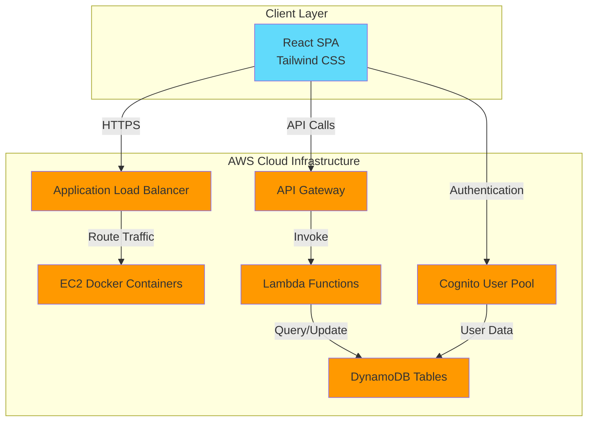

# BrewCraft React App

A comprehensive cloud-based restaurant and cafe management system built with React and deployed on AWS infrastructure. BrewCraft provides a full-featured web application for restaurant operations including table booking, menu management, user authentication, and real-time customer support.

## 🌐 Live System URLs

- **Production Application (Custom Domain)**: [https://brewcraft.rocks](https://brewcraft.rocks)
- **Production Application (ALB)**: [http://dev-brewcraft-alb-852606234.us-east-1.elb.amazonaws.com](http://dev-brewcraft-alb-852606234.us-east-1.elb.amazonaws.com)
- **API Gateway**: [https://4jawv6e5e1.execute-api.us-east-1.amazonaws.com](https://4jawv6e5e1.execute-api.us-east-1.amazonaws.com)

## 🏗️ System Architecture

BrewCraft follows a modern serverless architecture on AWS:



### Architecture Components

1. **Frontend Layer**
   - React 18.2.0 Single Page Application
   - Responsive UI with Tailwind CSS
   - Client-side routing with React Router
   - Deployed in Docker containers on EC2

2. **Authentication Layer**
   - AWS Cognito for user management
   - JWT-based authentication
   - Role-based access control (Customer/Admin)

3. **API Layer**
   - AWS API Gateway for RESTful endpoints
   - AWS Lambda for serverless business logic
   - WebSocket support for real-time chat

4. **Data Layer**
   - AWS DynamoDB for NoSQL storage
   - Tables: Users, Bookings, Menu, Chat Messages

5. **Load Balancing**
   - Application Load Balancer for high availability
   - Auto-scaling and health checks

## ✨ Core Features

### 🔐 User Authentication & Authorization
- User registration with email verification
- Secure login/logout with JWT tokens
- Role-based access (Customer/Admin)
- Password reset and account management

### 📅 Table Booking System
- Real-time table availability checking
- Smart capacity validation with warnings
- Booking confirmation and management
- Admin approval workflow
- Booking history tracking

### 🍽️ Menu Management
- Dynamic menu display by categories
- Menu item details with images
- Admin menu item CRUD operations

### 💬 Real-time Customer Support
- Customer-Admin chat system
- Conversation history
- WebSocket-based messaging
- Admin dashboard for support

### 👤 User Profile Management
- Profile information editing
- Avatar upload to S3
- View booking history
- Account settings

## 🛠️ Technology Stack

### Frontend
- **React** 18.2.0 - UI library
- **Tailwind CSS** 3.4.1 - Utility-first CSS framework
- **React Router DOM** 6.20.0 - Client-side routing
- **Radix UI** - Accessible component primitives
- **Lucide React** - Icon library
- **React Icons** - Additional icons

### Backend & Cloud
- **AWS Cognito** - User authentication & authorization
- **AWS Lambda** - Serverless functions
- **AWS DynamoDB** - NoSQL database
- **AWS API Gateway** - API management
- **AWS Application Load Balancer** - Traffic distribution
- **AWS EC2** - Container hosting
- **AWS S3** - File storage (avatars, images)

### Key Libraries
- `amazon-cognito-identity-js` - Cognito SDK
- `aws-sdk` - AWS service integration
- `jwt-decode` - JWT token handling
- `crypto-js` - Encryption utilities
- `uuid` - Unique ID generation
- `browser-image-compression` - Image optimization

## 📁 Project Structure

```
cloud-developing-group/
├── public/                      # Static assets
│   ├── index.html              # HTML template
│   ├── manifest.json           # PWA manifest
│   └── favicon.ico             # App icon
├── src/
│   ├── app/                    # Application pages & layouts
│   ├── components/             # Reusable React components
│   │   ├── Header.jsx         # Navigation header
│   │   ├── Footer.jsx         # Page footer
│   │   ├── Chatbox.jsx        # Real-time chat
│   │   └── ui/                # UI primitives (Button, Dialog, etc.)
│   ├── pages/                  # Main application pages
│   │   ├── Booking.jsx        # Table booking interface
│   │   ├── Menu.jsx           # Menu display
│   │   ├── Profile.jsx        # User profile
│   │   ├── AdminDashboard.jsx # Admin panel
│   │   └── ...
│   ├── lib/                    # Utility functions
│   ├── constants/              # App constants
│   ├── App.jsx                 # Main app component
│   ├── App.css                 # App styles
│   ├── index.js                # Entry point
│   └── index.css               # Global styles
├── dockerfile                   # Docker configuration
├── package.json                # Dependencies
├── tailwind.config.js          # Tailwind configuration
├── .env                        # Environment variables (not in git)
├── .gitignore                  # Git ignore rules
├── README.md                   # This file
└── README.txt                  # Plain text documentation
```

## 🚀 Getting Started

### Prerequisites
- **Node.js** >= 16.x
- **npm** or **pnpm**
- **Git**

### Local Development Setup

1. **Clone the repository**
   ```bash
   git clone <repository-url>
   cd cloud-developing-group
   ```

2. **Install dependencies**
   ```bash
   npm install
   ```

3. **Configure environment variables**
   
   Create a `.env` file in the root directory with the following variables:
   ```env
   # AWS Cognito Configuration
   COGNITO_CLIENT_ID=your_client_id
   COGNITO_CLIENT_SECRET=your_client_secret
   COGNITO_USER_POOL_ID=your_user_pool_id
   AWS_REGION=us-east-1
   
   # AWS Credentials (use temporary credentials)
   AWS_ACCESS_KEY_ID=your_access_key
   AWS_SECRET_ACCESS_KEY=your_secret_key
   AWS_SESSION_TOKEN=your_session_token
   
   # DynamoDB
   USERS_TABLE=USERS_TABLE
   
   # API Endpoints
   VITE_API_URL=http://dev-brewcraft-alb-852606234.us-east-1.elb.amazonaws.com
   REACT_APP_API_BASE_URL=https://4jawv6e5e1.execute-api.us-east-1.amazonaws.com
   VITE_API_GATEWAY_URL=https://4jawv6e5e1.execute-api.us-east-1.amazonaws.com
   ```

4. **Start the development server**
   ```bash
   npm start
   ```

5. **Open your browser**
   
   Navigate to [http://localhost:3000](http://localhost:3000)

### Build for Production

```bash
npm run build
```

The optimized production build will be created in the `build/` folder.


## Cloud Formation Stack
## CloudFormation Stack

Deploy the DynamoDB infrastructure:

```bash
cd Dynamo/cloudformation

aws cloudformation create-stack \
  --stack-name restaurant-dynamodb-dev \
  --template-body file://dynamo-website-stack.yaml \
  --parameters ParameterKey=EnvironmentName,ParameterValue=dev \
  --region us-east-1
```

See [Dynamo/README.md](Dynamo/README.md) for complete infrastructure documentation and [Dynamo/docs/DEPLOYMENT-GUIDE.md](Dynamo/docs/DEPLOYMENT-GUIDE.md) for detailed deployment instructions.

## Linting & Formatting
>>>>>>> ac07259ff2e5459c22bda1fec9ce44b9462d82a0

### Build Docker Image

```bash
docker build -t brewcraft-app .
```

### Run Docker Container

```bash
docker run -p 3000:3000 brewcraft-app
```

The application will be available at [http://localhost:3000](http://localhost:3000)

### Docker Compose (if available)

```bash
docker-compose up --build
```

## ☁️ AWS Configuration

### Region
- **Primary Region**: `us-east-1` (US East - N. Virginia)

### AWS Cognito
- **User Pool ID**: `us-east-1_phpgibZJD`
- **Client ID**: `10g093m0qo9fj9hsar5ngtp8ej`
- **Authentication Flow**: USER_PASSWORD_AUTH

### API Endpoints
- **Custom Domain**: `https://brewcraft.rocks`
- **ALB URL**: `http://dev-brewcraft-alb-852606234.us-east-1.elb.amazonaws.com`
- **API Gateway**: `https://4jawv6e5e1.execute-api.us-east-1.amazonaws.com`

### DynamoDB Tables
- `USERS_TABLE` - User profiles and metadata
- Additional tables for bookings, menu items, chat messages

## 🧪 Testing

Run the test suite:

```bash
npm test
```

Run tests in watch mode:

```bash
npm test -- --watch
```

## 📝 Available Scripts

| Command | Description |
|---------|-------------|
| `npm start` | Starts the development server on port 3000 |
| `npm run build` | Creates an optimized production build |
| `npm test` | Runs the test suite with React Testing Library |
| `npm run eject` | Ejects from Create React App (one-way operation) |

## 🔒 Security Best Practices

1. **Never commit `.env` files** to version control
2. **Rotate AWS credentials regularly** (use temporary credentials)
3. **Use IAM roles** with least privilege principle
4. **Enable MFA** for AWS accounts
5. **Regular security audits** and dependency updates
6. **HTTPS only** for production deployments
7. **Validate and sanitize** all user inputs
8. **Use AWS Secrets Manager** for sensitive data in production

## 🐛 Troubleshooting

### Build Errors

```bash
# Clear node_modules and reinstall
rm -rf node_modules package-lock.json
npm install

# Clear build cache
rm -rf build
```

### Authentication Issues

- Verify Cognito configuration in `.env`
- Check AWS credentials validity (temporary credentials expire)
- Ensure User Pool and Client IDs are correct
- Check Cognito User Pool settings in AWS Console

### API Connection Issues

- Verify API Gateway endpoint URLs
- Check CORS configuration in API Gateway
- Validate AWS region settings
- Check Lambda function logs in CloudWatch

### Docker Issues

- Ensure Docker daemon is running
- Check if port 3000 is available
- Verify Dockerfile configuration
- Check Docker logs: `docker logs <container-id>`

## 🤝 Contributing

### Development Guidelines

- Keep components **small and focused**
- Follow **React best practices** and hooks patterns
- Use **Tailwind CSS utility classes** for styling
- Place static assets in `public/` for fixed URLs
- Import images from `src/assets` for bundled assets
- Write **meaningful commit messages**
- **Test changes** before pushing

### Code Style

- ESLint configuration via `react-scripts`
- Consistent component structure
- Use functional components with hooks
- Proper prop validation

## 📊 Monitoring & Maintenance

### AWS CloudWatch
- Monitor application logs
- Set up alarms for errors and performance metrics
- Track Lambda function invocations and errors

### Application Load Balancer
- Check health checks status
- Monitor target group health
- Review access logs

### DynamoDB
- Monitor read/write capacity units
- Check for throttling events
- Review table metrics 


### Cognito
- Monitor user pool activity
- Track authentication failures
- Review user sign-up trends

## 📚 Additional Resources

- [React Documentation](https://react.dev/)
- [Tailwind CSS Documentation](https://tailwindcss.com/docs)
- [AWS Cognito Documentation](https://docs.aws.amazon.com/cognito/)
- [AWS Lambda Documentation](https://docs.aws.amazon.com/lambda/)
- [DynamoDB Documentation](https://docs.aws.amazon.com/dynamodb/)

## 📄 License

Internal project - Add a LICENSE file if you plan to open source this.

## 👥 Team & Support

For questions, issues, or contributions, please contact the development team.

---

**Version**: 1.0.0  
**Last Updated**: January 2026  
**Status**: Production  
**Deployment**: AWS Cloud Infrastructure
